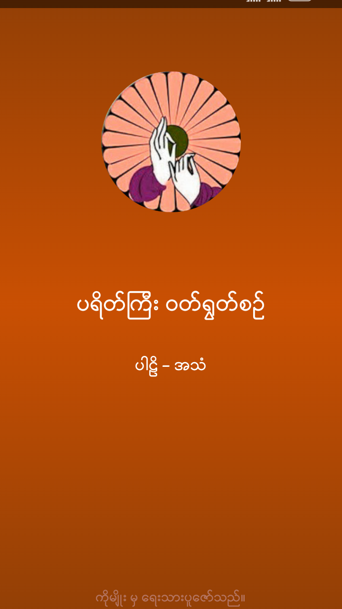
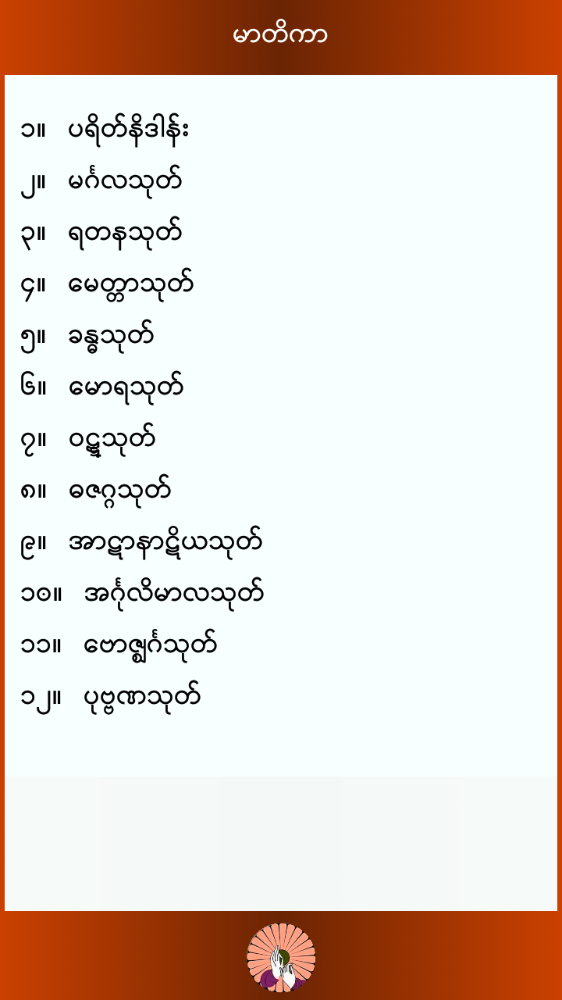
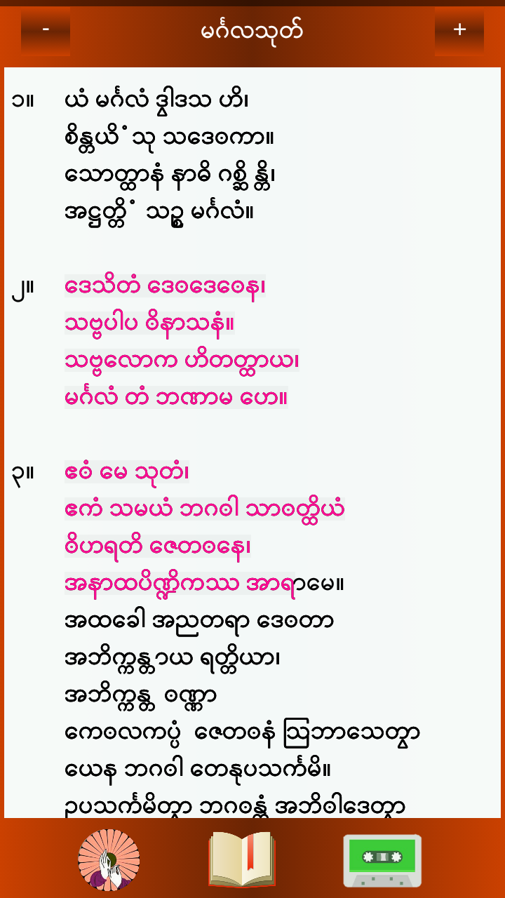

# ParateKyi 

This is the respository for Buddha Parate Kyi app for Android.

        	

## This app's main features:
1. Slick UI design with clear Parli words
2. Supports both Unicode and Zawgyi
3. Parli texts with karaoke-like text displaying
4. Skip to any Parli line with just a press
4. MP3 sound

### LICENSE

Free for all educational and personal uses, but any commercial use is strictly prohabited.
